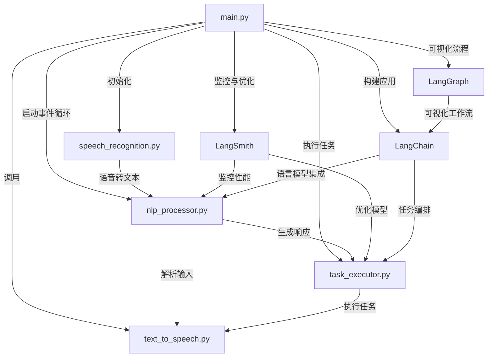

# Voice Assistant Project

## 功能介绍

本项目是一个基于Python开发的语音助手，支持以下核心功能：

1. **语音识别**：通过麦克风输入语音并转换为文本。
2. **文本处理**：对用户输入的文本进行自然语言处理（NLP），提取意图和关键信息。
3. **语音合成**：将处理后的文本转换为语音输出。
4. **任务执行**：根据用户指令执行特定任务，如查询天气、设置提醒等。

## 调用关系

以下是项目的调用架构图：



1. **主程序入口**：`main.py` 负责初始化语音助手并启动事件循环。
2. **语音识别模块**：`speech_recognition.py` 调用第三方API或本地模型实现语音转文本。
3. **NLP模块**：`nlp_processor.py` 解析用户输入并生成响应。
4. **语音合成模块**：`text_to_speech.py` 将文本转换为语音输出。
5. **任务执行模块**：`task_executor.py` 根据用户指令执行具体任务。
6. **LangSmith**：用于监控和优化语言模型的性能。
7. **LangChain**：用于构建基于语言模型的应用程序。
8. **LangGraph**：用于可视化语言模型的工作流程。

## 文件目录结构

```
.
├── .env
├── .gitignore
├── client_example.html
├── LangSmithIntegration.py
├── main.py
├── README.md
├── requirements.txt
├── serve.py
├── websocket_server.py
├── config/
│   ├── __init__.py
│   ├── settings.py
│   └── tools_config.json
├── core/
│   ├── __init__.py
│   ├── assistant.py
│   ├── langsmith_integration.py
│   ├── realtime_audio.py
│   ├── speech_utils.py
│   └── tool_registry.py
├── external_services/
│   ├── __init__.py
│   └── amap_service.py
├── langserve/
│   ├── __init__.py
│   └── assistant_chain.py
├── schemes/
│   ├── __init__.py
│   └── models.py
└── tools/
    ├── __init__.py
    ├── base_tool.py
    ├── calculator_tool.py
    ├── calendar_tool.py
    ├── file_tool.py
    ├── music_tool.py
    ├── system_tool.py
    └── weather_tool.py
```

## 依赖模块

以下是项目中使用的主要 Python 模块及其用途：

1. **SpeechRecognition**：用于语音识别，支持多种语音输入源。
2. **pyttsx3**：用于语音合成，将文本转换为语音输出。
3. **NLTK** 或 **spaCy**：用于自然语言处理（NLP），解析用户输入。
4. **Requests**：用于与外部 API 交互，如天气查询等。
5. **Logging**：内置模块，用于记录运行日志。
6. **ConfigParser**：用于解析配置文件。
7. **Whisper**：用于高质量的语音识别和转录。
8. **FastAPI**：用于构建高性能的 Web API 接口。
9. **LangChain**：用于构建基于语言模型的应用程序。
10. **LangGraph**：用于可视化语言模型的工作流程。
11. **LangServer**：提供语言模型服务的后端支持。
12. **LangSmith**：用于监控和优化语言模型的性能。
13. **websockets**：用于实时音频流的 WebSocket 通信。
14. **sounddevice**：用于音频录制和播放。
15. **scipy.io.wavfile**：用于音频文件的读写操作。
16. **numpy**：用于音频数据的数值处理。
17. **asyncio**：用于异步编程，支持实时音频处理。
18. **tempfile**：用于创建临时文件存储音频数据。
19. **importlib**：用于动态加载工具模块。
20. **json**：用于配置文件的读写和数据处理。
21. **Ollama**：用于本地运行大模型（如 deepseek-R1:14b）。
22. **sounddevice**：用于音频录制和播放。
23. **scipy.io.wavfile**：用于音频文件的读写操作。
24. **numpy**：用于音频数据的数值处理。
25. **asyncio**：用于异步编程，支持实时音频处理。
26. **tempfile**：用于创建临时文件存储音频数据。
27. **importlib**：用于动态加载工具模块。
28. **json**：用于配置文件的读写和数据处理。

## 大模型引用

项目通过 **Ollama** 本地运行 **deepseek-R1:14b** 大模型，具体配置如下：

1. 在 `settings.py` 中设置 `LLM_MODEL = "deepseek-R1:14b"`。
2. 在 `core/assistant.py` 中通过 `OllamaLLM` 类加载模型：
   ```python
   self.llm = OllamaLLM(model=settings.LLM_MODEL, temperature=0.7)
   ```
3. 确保本地已安装并运行 Ollama 服务，启动命令：
   ```bash
   ollama pull deepseek-R1:14b
   ollama run deepseek-R1:14b
   ```

## 高德地图 API 引用

高德地图的 API 配置在 `settings.py` 中，包括以下参数：

- `AMAP_API_KEY`：高德地图的 API 密钥。
- `AMAP_BASE_URL`：高德地图的基础 API 地址。

## 快速开始

1. 克隆项目到本地：
   ```bash
   git clone <repository-url>
   ```
2. 安装依赖：
   ```bash
   pip install -r requirements.txt
   ```
3. 运行主程序：
   ```bash
   python main.py
   ```